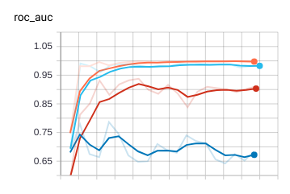

**1. Current results**

MEAN METRIC: 0.91 std 0.09

All metrics: [0.998, 0.77, 0.89, 0.99]



**3. Training data**

31 unique location, only 7 with target 1. 2288 - total annotated images 

**3. To train model**

 a. Prepare data by ```prepare_data.py```
 
 b. Adjust config in `config/config_classification.yml`
 
 c. train models run ``train.py``
 
 d. Watch tensorboad logs `tensorboard --logdir ./lightning_logs/`
 
 **TODO:**
 * Collect more data
 * Inference
 * Deployment 