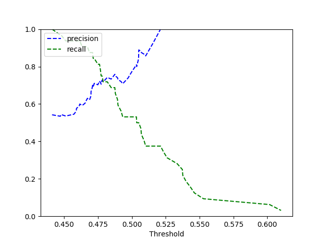

**1. Current results**

TTA results increase metrics on test (flip_lr and flip_ud)

#### Fire detections

OOF metrics:
* MEAN METRIC: 0.953 std 0.051
* ALL METRICS: [0.999, 0.976, 0.868, 0.97]

Test metrics:
* ROC AUC 0.947
* Precision 0.816
* Recall 0.74


#### Smoke detections

Test metrics:
* ROC AUC 0.94
* Precision 0.1
* Recall 0.85




**3. Training data**

Fire: 31 unique location, only 7 with target 1. 2288 - total annotated images 
Smoke train: 17 unique location, only 15 with target 1. 2k+ - total annotated images

**3. To train model**

 a. Prepare data by ```prepare_data.py```
 
 b. Adjust config in `config/config_classification.yml`
 
 c. train models run ``train.py``
 
 d. Watch tensorboad logs `tensorboard --logdir ./lightning_logs/`
 
 e. All inference and deploy param specified in `deploy_model` folder
 
 d. Collect up-to-date requirements.txt call `pipreqs --force`
 
 **TODO:**
 * Collect more data 
 